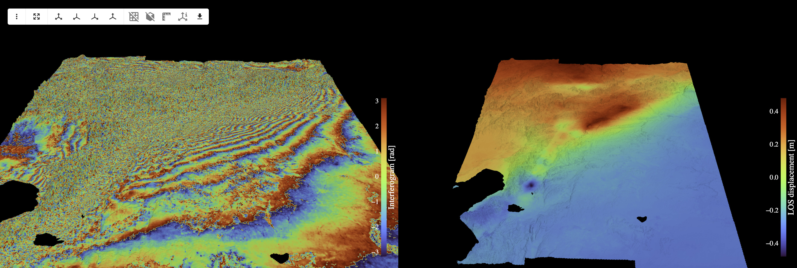
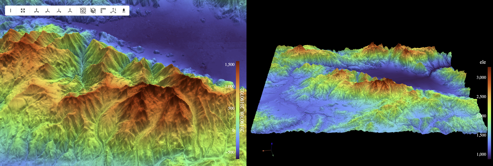

## InSAR.dev—Python Ecosystem for Interferometric Synthetic Aperture Radar

## Components

| Package | Description | License |
|---------|-------------|---------|
| [insardev](./insardev/) | Core interferometric processing and analysis | InSARdev-SAL-1.0 |
| [insardev_pygmtsar](./insardev_pygmtsar/) | GMTSAR-based Sentinel-1 SLC preprocessing | BSD 3-Clause |
| [insardev_toolkit](./insardev_toolkit/) | Utility functions and helper tools | BSD 3-Clause |

## Features

- Sentinel-1 SLC bursts processing pipeline
- Interferogram generation, filtering, detrending, unwrapping
- Time series analysis (SBAS, PSI)

## Examples

 **Central Türkiye Earthquakes (2023).** Interferogram covering two consecutive Sentinel-1 scenes (56 bursts) with GPU-accelerated phase unwrapping.

 **Erzincan Elevation, Türkiye (2019).** This example reproduces 29-page ESA document [DEM generation with Sentinel-1 IW](https://step.esa.int/docs/tutorials/S1TBX%20DEM%20generation%20with%20Sentinel-1%20IW%20Tutorial.pdf).

## License

This repository contains components with different licenses:

- **insardev/** - InSAR.dev Source-Available License (see [insardev/LICENSE](./insardev/LICENSE))
- **insardev_pygmtsar/** - BSD 3-Clause License (see [insardev_pygmtsar/LICENSE](./insardev_pygmtsar/LICENSE))
- **insardev_toolkit/** - BSD 3-Clause License (see [insardev_toolkit/LICENSE](./insardev_toolkit/LICENSE))

For Commercial Use of the insardev package, see [insardev/SUBSCRIBE](./insardev/SUBSCRIBE).

## Contact

- Author: Aleksei Pechnikov
- Email: alexey@pechnikov.dev
- ORCID: https://orcid.org/0000-0001-9626-8615

## Bug Reports

Bug reports and suggestions are welcome via the project's issue tracker.
